# FIND-U — Diagrama de Componentes

> Vista de componentes del ecosistema FIND-U centrada en **ARCHITECTURE** (infraestructura
> transversal) y **CORE** (dominio de negocio), más SECURITY y los frontends como contexto.
>
> Convención de líneas:
> - Línea sólida (`-->`): llamada síncrona (HTTP/REST a través del gateway o descubrimiento Eureka).
> - Línea punteada (`-.->`): comunicación asíncrona (mensajería RabbitMQ) o registro/descubrimiento.
>
> Estado de cada componente (desplegado en `docker-compose.yml` vs. solo compilado) se indica
> con el color de relleno (ver leyenda al final).

```mermaid
graph TB
    %% ===================== ACTORES / FRONTEND =====================
    subgraph CLIENTS["👥 Clientes (Host / Navegador)"]
        FE_CLI["Frontend Cliente<br/>(Vite · :3000)"]
        FE_PROV["Frontend Proveedor<br/>(Vite · :3001)"]
    end

    %% ===================== ARCHITECTURE =====================
    subgraph ARCH["🏛️ ARCHITECTURE — Infraestructura transversal"]
        GW["API Gateway<br/>(Spring Cloud Gateway · :8080)"]
        EUREKA["Eureka Server<br/>(Service Discovery · :8761)"]
        CONFIG["Config Server<br/>(Spring Cloud Config · :8888)<br/>⚠️ no desplegado"]
    end

    %% ===================== SECURITY =====================
    subgraph SEC["🔐 SECURITY"]
        AUTH["findu-spring-security<br/>(WebFlux · R2DBC · JWT)"]
        OAUTH["autorization-server-oauth2<br/>(OAuth2 / OIDC · JPA)"]
    end

    %% ===================== CORE =====================
    subgraph CORE["⚙️ CORE — Dominio de negocio"]
        COREAPP["findu-core<br/>(Perfiles · Solicitudes · Ofertas ·<br/>Especialidades · Calificaciones · Catálogo)"]
        NOTIFP["findu-notification-processor<br/>(WebFlux · AMQP · Push/SES/SNS)"]
        HELP["findu-help-v2<br/>(Tickets · MongoDB · S3)<br/>⚠️ no desplegado"]
        TRANSACTION["findu-transaction<br/>(Pagos · Liquidaciones · Deudas)<br/>⚠️ no desplegado"]
    end

    %% ===================== LAMBDAS =====================
    subgraph LAMBDA["λ CORE/LAMBDA — Funciones / workers"]
        DISPATCH["notification-dispatcher<br/>(Spring Cloud Function · :9000)"]
        LREFUND["transaction-refund<br/>⚠️ no desplegado"]
        LPAYOUT["transaction-provider-payout<br/>⚠️ no desplegado"]
        LBALANCE["transaction-daily-balance<br/>⚠️ no desplegado"]
    end

    %% ===================== DATOS / INFRA =====================
    subgraph DATA["🗄️ Datos & Mensajería"]
        PGSEC[("PostgreSQL<br/>security")]
        PGOAUTH[("PostgreSQL<br/>oauth2")]
        PGCORE[("PostgreSQL<br/>core")]
        MONGO[("MongoDB<br/>help ⚠️")]
        REDIS[("Redis<br/>cache / tokens")]
        RABBIT{{"RabbitMQ<br/>eventos"}}
        LOCALSTACK["LocalStack<br/>(DynamoDB·SES·SNS·S3)"]
    end

    %% ---------- Frontend -> Gateway ----------
    FE_CLI -->|REST| GW
    FE_PROV -->|REST| GW
    FE_PROV -.->|WebSocket /ws/events| GW

    %% ---------- Gateway -> servicios (lb:// vía Eureka) ----------
    GW -->|/security-auth/**| AUTH
    GW -->|/authorization-server/**| OAUTH
    GW -->|/findu-core/**| COREAPP
    GW -->|/findu-transaction/**| TRANSACTION
    GW -->|/findu-help-v2/**| HELP
    GW -->|/ws · /notification-dispatcher/**| DISPATCH

    %% ---------- Registro en Eureka ----------
    GW -.->|register/discover| EUREKA
    AUTH -.-> EUREKA
    OAUTH -.-> EUREKA
    COREAPP -.-> EUREKA
    NOTIFP -.-> EUREKA
    TRANSACTION -.-> EUREKA
    HELP -.-> EUREKA
    DISPATCH -.-> EUREKA
    CONFIG -.-> EUREKA

    %% ---------- Config Server (previsto) ----------
    CONFIG -.->|config previsto| COREAPP

    %% ---------- Dependencias de datos ----------
    AUTH --> PGSEC
    AUTH --> REDIS
    AUTH --> LOCALSTACK
    OAUTH --> PGOAUTH
    COREAPP --> PGCORE
    COREAPP --> REDIS
    HELP --> MONGO
    TRANSACTION --> PGCORE

    %% ---------- Flujos asíncronos (notificaciones) ----------
    AUTH -.->|notificar| DISPATCH
    COREAPP -.->|notificar| DISPATCH
    DISPATCH -.->|publica evento| RABBIT
    RABBIT -.->|consume| NOTIFP
    NOTIFP --> REDIS
    NOTIFP --> LOCALSTACK
    DISPATCH --> LOCALSTACK

    %% ---------- Transaction -> workers (previsto) ----------
    TRANSACTION -.->|refund| LREFUND
    TRANSACTION -.->|payout| LPAYOUT
    TRANSACTION -.->|cierre diario| LBALANCE

    %% ===================== ESTILOS =====================
    classDef deployed fill:#1e3a2f,stroke:#10b981,stroke-width:2px,color:#eafff5;
    classDef notdeployed fill:#3a2a1e,stroke:#f59e0b,stroke-width:2px,color:#fff4e6,stroke-dasharray: 5 3;
    classDef data fill:#1e2a3a,stroke:#38bdf8,stroke-width:2px,color:#e6f4ff;
    classDef client fill:#2e1b3a,stroke:#c084fc,stroke-width:2px,color:#f6ecff;

    class FE_CLI,FE_PROV client;
    class GW,EUREKA,AUTH,OAUTH,COREAPP,NOTIFP,DISPATCH deployed;
    class CONFIG,HELP,TRANSACTION,LREFUND,LPAYOUT,LBALANCE notdeployed;
    class PGSEC,PGOAUTH,PGCORE,MONGO,REDIS,RABBIT,LOCALSTACK data;
```

## Leyenda

| Color | Significado |
|-------|-------------|
| 🟢 Verde | Componente **desplegado** en `docker-compose.yml` (stack activo) |
| 🟠 Naranja (borde punteado) | Componente **compilado pero no desplegado** (existe el código, no está en el compose) |
| 🔵 Azul | Almacén de datos o broker de mensajería |
| 🟣 Morado | Frontend / cliente |

## Notas de la vista

- **El API Gateway ya enruta** a `FINDU-TRANSACTION`, `FINDU-HELP-V2` y `NOTIFICATION-DISPATCHER`,
  aunque los dos primeros aún no están en el `docker-compose.yml`. El diseño ya los contempla.
- **findu-core** concentra el dominio funcional: perfiles (cliente/proveedor), solicitudes, ofertas,
  especialidades, credenciales, portafolio, calificaciones, direcciones y catálogo.
- **Config Server** está implementado pero ningún servicio declara el cliente de config; hoy está huérfano.
- Las flechas punteadas de **transaction → lambdas** representan el diseño previsto; a nivel de código
  esas lambdas son despliegues independientes (en producción, AWS Lambda).
