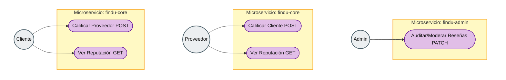

# Diagrama de Casos de Uso — Calificación y Retroalimentación

Diagrama alineado al estilo clásico de casos de uso. Presenta a los tres actores del flujo: **Admin** (moderación en findu-admin), **Proveedor** y **Cliente** (valoración mutua en findu-core). La frontera de cada módulo está marcada en tono **ámbar**.

Puedes visualizarlo en el IDE (extensión Mermaid) o en Mermaid Live Editor.

Documentación ampliada del flujo y API: [findu-core-architecture.md](./findu-core-architecture.md).