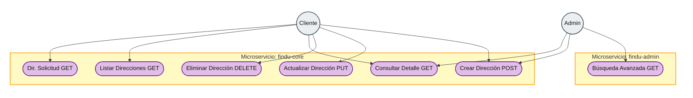

# Diagrama de Casos de Uso — Gestión de Direcciones y Ubicaciones

Diagrama alineado al estilo clásico de casos de uso: **admin arriba**, **cliente abajo**, actor a la **izquierda**, frontera del sistema (microservicio) en **ámbar** y casos de uso en **púrpura**. Mermaid no soporta `useCaseDiagram` como PlantUML; esta versión usa `flowchart` con estilos.

Puedes visualizarlo en el IDE (extensión Mermaid) o en Mermaid Live Editor.

Documentación ampliada del flujo y API: [findu-core-architecture.md](./findu-core-architecture.md).