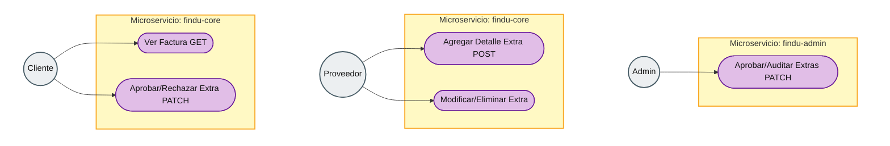

# Diagrama de Casos de Uso — Facturación y Cobros Adicionales

Diagrama alineado al estilo clásico de casos de uso. Muestra la interacción de la triada: el **Admin** (monitoreo/auditoría superior), el **Proveedor** (gestión de cobros extra) y el **Cliente** (visibilidad y aprobación).

Puedes visualizarlo en el IDE (extensión Mermaid) o en Mermaid Live Editor.

