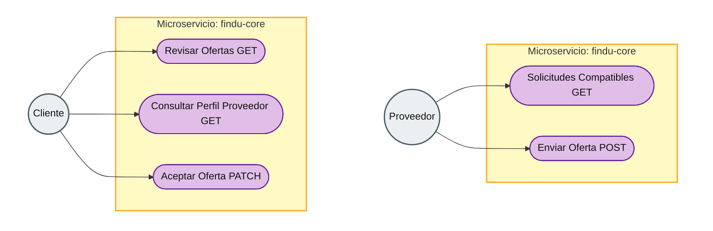

# Diagrama de Casos de Uso — Análisis de Ofertas de Profesionales

Diagrama alineado al estilo clásico de casos de uso. En este flujo bidireccional, el actor **Proveedor** interactúa desde la parte superior (descubriendo oportunidades y ofertando) y el actor **Cliente** desde la parte inferior (evaluando y aceptando). La frontera del sistema en tono **ámbar** representa el núcleo de operaciones en `findu-core`.

Puedes visualizarlo en el IDE (extensión Mermaid) o en Mermaid Live Editor.

Documentación ampliada del flujo y API: [findu-core-architecture.md](./findu-core-architecture.md).