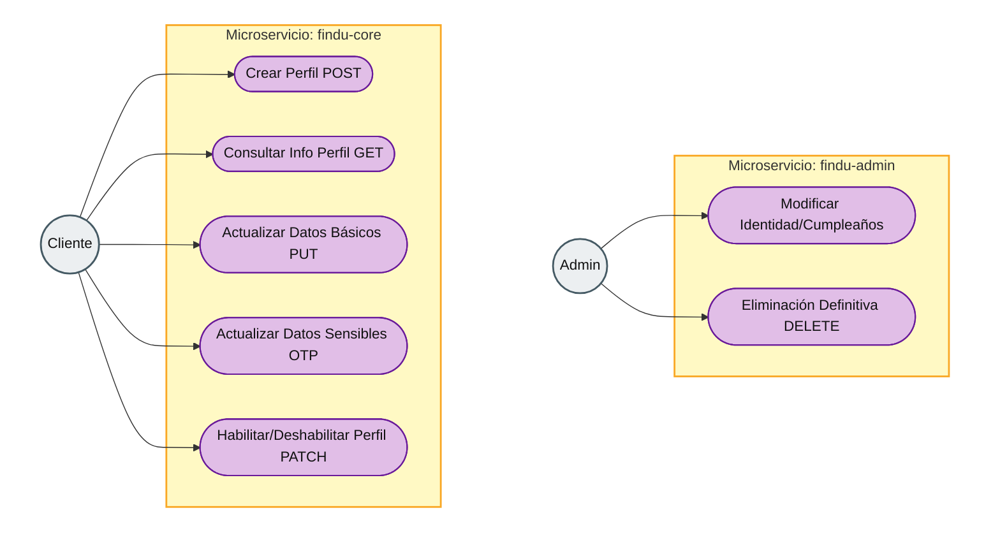
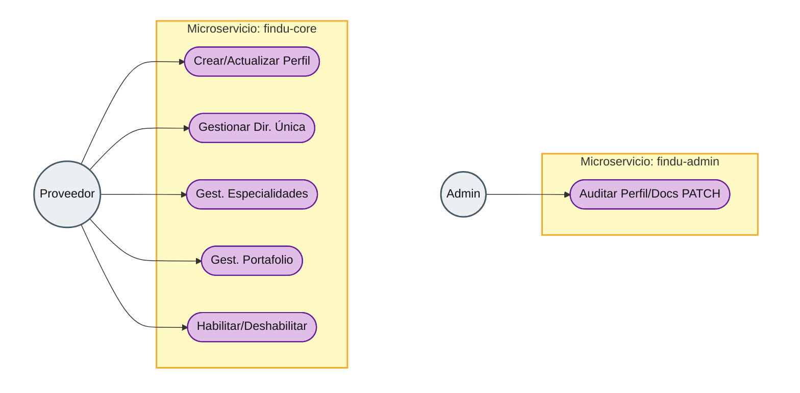
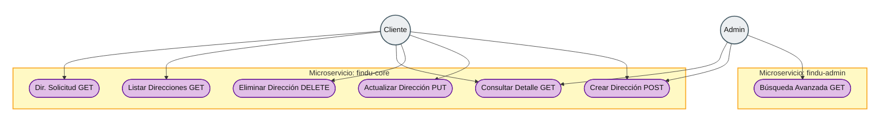
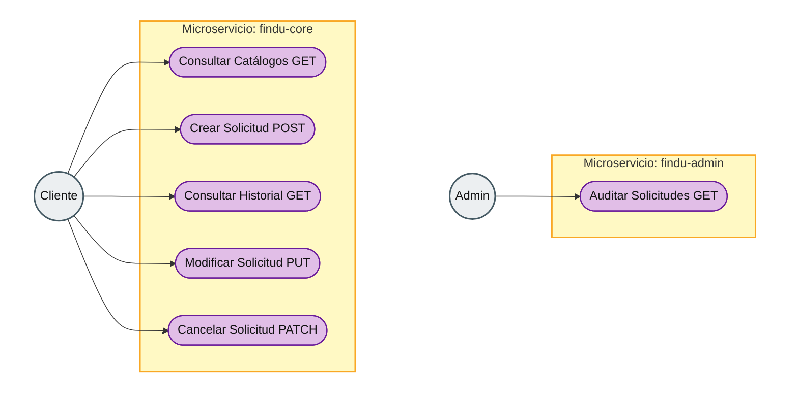
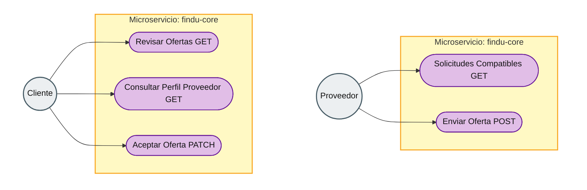
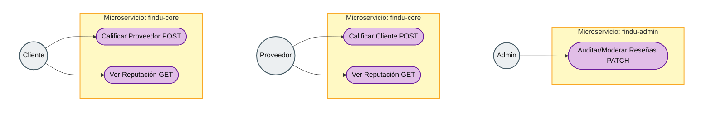

# FINDU — Arquitectura técnica: findu-core

**Documento padre:** [Arquitectura del ecosistema](../findu-ecosystem-architecture.md)

**Autor:** Miguel Angel Mercado Tirado · **Fecha:** Mayo 2026 · **Versión:** 1.0

## __1\. Introducción__

Este documento detalla la arquitectura, casos de uso y modelo de datos específicos del microservicio **findu-core**. Este servicio es el cerebro del negocio transaccional de la plataforma Findu, encargado de gestionar los perfiles de usuarios (clientes y proveedores), las direcciones, el emparejamiento (matching), el sistema de ofertas (bidding), la facturación y el sistema de calificaciones.

## __2\. Módulos y Casos de Uso__

Este servicio maneja la lógica transaccional de la aplicación\.

__Módulos Principales:__

- __Gestión de Perfiles:__ Administración integral de cuentas tanto para clientes como para proveedores (Hoja de Vida, validaciones).
- __Gestión de Direcciones:__ Control de ubicaciones y georreferenciación para la prestación de servicios.
- __Gestión de Solicitudes y Matching:__ Publicación de requerimientos del cliente y filtrado inteligente de profesionales por zona de influencia y especialidad.
- __Sistema de Ofertas (Bidding):__ Negociación donde los proveedores postulan sus presupuestos y el cliente selecciona la mejor opción.
- __Facturación:__ Liquidación de servicios prestados, cálculo de comisiones e integración de recargos adicionales.
- __Sistema de Calificaciones:__ Retroalimentación mutua para la construcción de reputación en la plataforma.

### Casos de Uso Específicos:

Basados en el [modelo físico de datos (ERD)](#erd-findu-core-modelo-bd) de findu-core, las interacciones y capacidades principales del sistema son:

1. **Gestión de Perfil Cliente:** El cliente gestiona su información personal, contacto, imagen de perfil y el estado de su cuenta, con reglas de integridad, OTP para datos sensibles y operaciones administrativas separadas. El detalle operativo, API y diagrama se documentan en la subsección siguiente (alineado con Casos_Uso_Perfil_Diagrama.md).
2. **Gestión de Perfil Proveedor:** El profesional registra su hoja de vida (HV), especialidades y zonas de cobertura. Se incluye un flujo de revisión administrativa para validar documentos antes de ser aprobado para ofertar en la plataforma.
3. **Gestión de Direcciones y Ubicaciones:** El cliente define una **dirección principal** (ligada al alta de perfil) y, por solicitud, puede usar **otra dirección** donde se prestará el servicio si no quiere la principal. Puede **editar siempre** la dirección principal; la dirección de una `SOLICITUD_SERVICIO` la edita con libertad **solo mientras la solicitud no tenga proveedor asignado**; una vez **programada** con proveedor, cualquier cambio de ubicación debe ser **aceptado por el proveedor**. Detalle en la subsección siguiente.
4. **Gestión de Solicitudes de Servicios Georreferenciados:** El cliente puede crear una `SOLICITUD_SERVICIO` asociando un tipo de servicio específico, la dirección donde se requiere la atención, una fecha/hora programada, y definir parámetros como cantidad estimada, presupuesto máximo, y prioridad.
5. **Análisis de Ofertas de Profesionales (Matching y Bidding):** Ante una solicitud activa, el cliente recibe y revisa múltiples `OFERTAS` de proveedores interesados, pudiendo evaluar el presupuesto ofrecido y el mensaje de presentación (pitch).
6. **Facturación:** Liquidación del servicio una vez concluido o en proceso de cierre, gestionando conceptos base, cobros adicionales por repuestos o tiempo extra, y la respectiva retención de comisión de la plataforma.
7. **Calificación y Retroalimentación:** Al finalizar un trabajo, el cliente otorga `CLASIFICACIONES` al perfil especializado del proveedor, dejando un puntaje y comentarios que afectan el ranking global del profesional en la plataforma.

#### Gestión de Perfil Cliente: diagrama de casos de uso

El siguiente diagrama replica la **estructura visual** de un diagrama de casos de uso clásico: **admin arriba** y **cliente abajo**, actor a la **izquierda** y frontera del sistema (microservicio) en tono **ámbar**, casos de uso en tono **púrpura**. Mermaid no implementa `useCaseDiagram` nativo; este `flowchart` es la aproximación recomendada. Misma semántica que [Casos_Uso_Perfil_Diagrama.md](./Casos_Uso_Perfil_Diagrama.md) (también en [Mermaid Live Editor](https://mermaid.live/)).

#### Gestión de Perfil Cliente: definición detallada de procesos

**A. Crear Perfil** (`POST /api/v1/perfil-cliente`)

- **Descripción:** Registro inicial del perfil de cliente tras la autenticación en el microservicio de seguridad (`findu-security`).
- **Datos obligatorios:** Nombre completo, número de identificación, tipo de identificación, fecha de nacimiento, sexo y celular.
- **Lógica:** El registro se vincula a `auth_user_id`. El estado inicial por defecto es **ACTIVO**.

**B. Consultar Perfil** (`GET /api/v1/perfil-cliente/{id}`)

- **Descripción:** Recupera la información completa del perfil, incluyendo el promedio de calificación y las direcciones asociadas.
- **Criterio de acceso:** Solo el dueño del perfil o un administrador pueden obtener este detalle completo.

**C. Actualizar Perfil** (`PUT /api/v1/perfil-cliente/{id}`)

Reglas de negocio para mantener la integridad del sistema:

| Categoría | Campos | Regla |
|-----------|--------|--------|
| **Datos de identidad (bloqueados para el cliente)** | `fecha_nacimiento`, `numero_identificacion`, `tipo_identificacion` | No son editables por el cliente. Cualquier cambio debe solicitarse y ejecutarse por un **Administrador** previa validación con documentos físicos. |
| **Datos de contacto (seguridad OTP)** | `correo_electronico`, `celular` | Pueden modificarse, pero requieren validación en dos pasos (OTP enviado al **nuevo** dato) antes de persistir el cambio en base de datos. |
| **Datos libres** | Nombre (opcionalmente), `url_imagen_perfil` (objeto en S3) | Actualización directa sin OTP. |

**D. Gestión de estado** (`PATCH /api/v1/perfil-cliente/{id}/estado`)

- **Deshabilitar:** El cliente puede desactivar (“apagar”) su perfil.
- **Validación crítica:** El sistema debe comprobar que el cliente **no** tenga solicitudes de servicio en estados **ABIERTA**, **PROGRAMADA** o **EN_CURSO**. Si existen procesos pendientes en esos estados, la operación se **rechaza**.
- **Habilitar:** Re-activación del perfil para volver a usar la plataforma (flujo simple, sin las restricciones de deshabilitación salvo políticas adicionales que defina el producto).

**E. Eliminación (nota administrativa)**

- **Eliminación definitiva** (`DELETE`): **No** está disponible para el cliente. El borrado físico o ejercicio del “derecho al olvido” es potestad **exclusiva del Admin**, para evitar borrados de perfiles con deudas, disputas o procesos legales/pendientes en la plataforma.

#### Gestión de Perfil Proveedor: diagrama y definición detallada

Este caso de uso encapsula la creación y administración del profesional. Comparte limitantes de seguridad y auditoría con el perfil cliente (OTP para datos de contacto, inmutabilidad de identidad), pero introduce reglas específicas de negocio: una única dirección física, múltiples perfiles especialistas y un portafolio de evidencias.

**Diagrama de casos de uso**

**1. Gestión de Perfil General y Dirección Única**
- **Crear/Actualizar Perfil (`POST` / `PUT`)**: La creación del perfil proveedor es un flujo totalmente independiente y excluyente del perfil cliente. Funcionan como submódulos separados dentro de la gestión de perfiles, aunque comparten lógicas y comportamientos base (como la inmutabilidad de los datos de identidad física y la validación OTP para actualizar correo o celular).
- **Dirección Única**: A diferencia del cliente, el proveedor **no** puede registrar múltiples direcciones en su catálogo. Su perfil exige **una (1) dirección física base** operativa, gestionada a través de un endpoint exclusivo que la sobrescribe (`PUT /api/v1/perfil-proveedor/{id}/direccion`).
- **Estado (`PATCH`)**: Control para habilitar o deshabilitar la cuenta general, sujeto a bloqueos sistémicos si el proveedor posee ofertas en estado `ACEPTADA` o servicios `EN_CURSO`.

**2. Gestión de Perfiles Especialistas (Sub-módulo 1:N)**
- Un proveedor puede ofrecer servicios en múltiples ramas de especialidad (ej. "Enfermería" y "Babysitting").
- **Regla Crítica**: Al crear el perfil general, es **obligatorio** registrar al menos un (1) perfil especialista para poder ser visible y emparejado en el motor de matching.
- **`POST /api/v1/perfiles-especialistas`**: Añade una nueva especialidad al proveedor.
- **`PATCH /api/v1/perfiles-especialistas/{id}/estado`**: Permite deshabilitar temporalmente una especialidad puntual (y ocultarla de las búsquedas) sin afectar el resto del perfil del profesional.
- **`DELETE /api/v1/perfiles-especialistas/{id}`**: Elimina la especialidad del catálogo personal.

**3. Gestión de Portafolio de Evidencias (Sub-módulo 1:N respecto a la Especialidad)**
- Colección de fotografías y descripciones de trabajos previos adjuntos a una especialidad. Esto nutre la Hoja de Vida (HV) y hace más atractivas sus ofertas frente a la decisión del cliente.
- **Regla Crítica**: **No es obligatorio** crear ítems de portafolio de inmediato al momento de registrar la especialidad.
- **`POST /api/v1/perfiles-especialistas/{id}/portafolio`**: Sube un ítem comercial (texto descriptivo + imagen cargada en AWS S3).
- **`DELETE /api/v1/portafolio/{item_id}`**: Borrado libre de ítems de la galería visual del proveedor.

**4. Zona de Influencia (Cobertura Geográfica)**
- **`PUT /api/v1/perfil-proveedor/{id}/cobertura`**: Endpoint para definir y actualizar la lista de municipios (mediante código DANE) a los cuales el proveedor está dispuesto a desplazarse.

#### Gestión de Direcciones y Ubicaciones: definición detallada

Este caso de uso encapsula todas las reglas técnicas para el ciclo de vida de las direcciones de los usuarios, garantizando la inmutabilidad en servicios transaccionales.

**Diagrama de casos de uso**

**1. Creación Inicial y Mapeo en Perfiles**
- **Perfil Cliente (`POST`)**: Al crear su cuenta, el cliente puede registrar múltiples direcciones y asignarles etiquetas personalizadas (ej. "Principal", "Oficina", "Casa de los padres").
- **Perfil Proveedor (`POST` - *Nota a futuro*)**: Cuando se implemente la creación de proveedores, el sistema exigirá y creará una **única** dirección principal vinculada a su perfil.
- **Regla Universal**: Todo usuario (sin importar su rol) debe mantener en todo momento **al menos una dirección registrada** en el sistema.

**2. Direcciones en Solicitudes de Servicio (`SOLICITUD_SERVICIO`)**
Al momento de crear una solicitud de servicio, el sistema protege el historial de la transacción aislando la ubicación final. Existen dos caminos al crear la solicitud:
- **Reutilizar una dirección existente**: El usuario selecciona una ubicación de su catálogo personal. En este caso, el sistema **crea una copia exacta (snapshot)** de dicha dirección en base de datos, de uso exclusivo para esa solicitud. 
- **Crear una dirección al vuelo**: El usuario ingresa una ubicación totalmente nueva y puntual para el servicio a contratar, la cual queda asociada únicamente a esa solicitud.

*Consideración técnica*: Esta desnormalización por copia asegura que si un cliente actualiza o elimina su dirección de "Oficina" meses después, el histórico de los servicios que se prestaron ahí no alterará sus metadatos geográficos ni su auditoría transaccional.

**3. Endpoints Independientes de Mantenimiento de Direcciones**
La gestión de la entidad dirección está completamente desacoplada; **no va** en el PUT de actualizar perfil ni en el PUT de servicio. Cuenta con su propia suite de APIs independientes:

- **`POST /api/v1/direcciones`**: Permite agregar una nueva dirección a un perfil (disponible para el usuario en sesión o para un admin).
- **`PUT /api/v1/direcciones/{id}`**: Modifica los atributos de una dirección personal (coordenadas, piso, apartamento). Gracias a la regla del punto 2, este cambio no contamina las copias generadas en solicitudes en curso o finalizadas.
- **`DELETE /api/v1/direcciones/{id}`**: Permite al cliente limpiar ubicaciones obsoletas. **Validación Crítica:** Se rechaza la operación si el intento de borrado dejaría al perfil sin direcciones (ya que mínimo debe tener una).
- **`GET /api/v1/direcciones/{id}`**: Obtiene el detalle exacto de una dirección en específico.
- **`GET /api/v1/perfil-cliente/{id_cliente}/direcciones`**: Lista el catálogo completo de ubicaciones de un perfil cliente.
- **`GET /api/v1/solicitud-servicio/{id_solicitud}/direccion`**: Obtiene los datos geográficos de la copia de dirección específica de una solicitud o servicio prestado.
- **`GET /api/v1/admin/direcciones`**: Endpoint administrativo equipado con filtros de búsqueda especializados (búsqueda por geozonas, municipio, dueños, etc.).

#### Caso de Uso: Gestión de Solicitudes de Servicios Georreferenciados

Este proceso describe el ciclo de vida completo desde el consumo de catálogos maestros, la creación del requerimiento por parte del cliente, las modificaciones permitidas, las penalidades por cancelación y la gobernanza de auditoría según los estados transaccionales.

**Diagrama de casos de uso**

**1. Endpoints de Consulta y Preparación (Lectura para Frontend)**
Para que el usuario y el frontend puedan estructurar la solicitud, se exponen los siguientes servicios de consulta:
- `GET /api/v1/categorias`: Retorna el árbol jerárquico de categorías activas para navegación.
- `GET /api/v1/servicios?categoria_id=`: Retorna el catálogo de servicios específicos asociados a la categoría seleccionada (incluyendo su `tipo_cobro` por defecto).
- `GET /api/v1/direcciones/municipios`: Maestro de ciudades habilitadas (basado en Código DANE) para mapeo geográfico.

**2. Definición Detallada de Procesos del Flujo Principal**

- **Crear Solicitud (`POST /api/v1/solicitudes`)**:
  * **Flujo del Usuario**: El cliente selecciona una de sus múltiples direcciones guardadas (`direccion_id`), el servicio específico (`servicio_id`), define la fecha y hora programada, el nombre/teléfono del contacto en sitio que recibirá al proveedor, el nivel de prioridad (Escala 1-5) y el presupuesto máximo dispuesto a pagar (este campo acepta `NULL` indicando que no hay límite para recibir ofertas abiertas).
  * **Estado Inicial**: Toda solicitud nueva nace con `estado_solicitud = 'ABIERTA'`.

- **Consultar Historial (`GET /api/v1/solicitudes/cliente/{cliente_id}`)**:
  * Permite al usuario visualizar el histórico completo de sus pedidos (activos, finalizados y cancelados) con paginación y ordenamiento cronológico invertido.

- **Reglas de Modificación de la Solicitud (`PUT /api/v1/solicitudes/{id}`)**:
  * **Estados Permitidos**: Los atributos de la solicitud (dirección de atención, fecha/hora, contacto, etc.) son mutables **únicamente** cuando la solicitud se encuentra en los estados **`ABIERTA`** o **`EN_NEGOCIACION`** (es decir, antes de que exista un proveedor asignado).
  * **Estados Bloqueados**: Una vez que la solicitud pasa a **`PROGRAMADA`**, **`EN_CURSO`**, **`FINALIZADA`**, o cualquiera de los estados de cancelación, todos los atributos quedan congelados de forma inmutable para proteger el contrato con el proveedor.

- **Reglas de Cancelación de la Solicitud (`PATCH /api/v1/solicitudes/{id}/cancelar`)**:
  * El cliente puede solicitar la cancelación autónoma del pedido. El sistema evaluará el tiempo de anticipación respecto a la fecha/hora programada y el estado actual para aplicar las siguientes reglas:
    1. **Cancelación sin Penalidad (`CANCELADA_SIN_PENALIDAD`)**:
       - Se aplica de forma inmediata si la solicitud está en estado **`ABIERTA`** o **`EN_NEGOCIACION`** (sin proveedor asignado).
       - Se aplica si la solicitud está en estado **`PROGRAMADA`** (proveedor asignado) pero la cancelación ocurre con **8 horas o más de anticipación** respecto a la fecha y hora pactadas para el servicio.
    2. **Cancelación con Penalidad (`CANCELADA_CON_PENALIDAD`)**:
       - Se aplica si la solicitud está en estado **`PROGRAMADA`** y la cancelación ocurre **dentro de las 8 horas previas** a la cita. Este estado gatilla un evento asíncrono hacia el microservicio `findu-payment` para procesar el cobro de la multa al cliente.
    3. **Cancelación Bloqueada**: No se permite la cancelación bajo ninguna circunstancia si la solicitud se encuentra en estado **`EN_CURSO`** o **`FINALIZADA`**.

**3. Restricciones de Gobernanza y Auditoría**
- **Inmutabilidad de Registros (No Delete)**: Está estrictamente prohibido el borrado físico (`DELETE`) o el borrado lógico que oculte el registro (`is_deleted = true`). Todas las transacciones deben permanecer 100% visibles e históricas en la base de datos para auditorías de la plataforma, reportería legal y control de recibos. El estado de la fila (`estado_solicitud`) es el único indicador de su ciclo de vida.

**4. Vista de Administración (Lectura para findu-admin)**
- `GET /api/v1/admin/solicitudes`: Endpoint exclusivo para administradores que permite consultar, auditar y filtrar el universo completo de servicios mediante queries de filtrado flexible (por rango de fechas, municipio, prioridad, cliente, proveedor o estado).

#### Caso de Uso: Análisis de Ofertas de Profesionales (Matching y Bidding)

Este proceso describe la interacción bidireccional en el marketplace: la forma en que los proveedores descubren oportunidades compatibles y compiten por ellas, y cómo el cliente evalúa y selecciona al mejor profesional.

**Diagrama de casos de uso**

**1. Matching y Descubrimiento (Perspectiva del Proveedor)**
- **`GET /api/v1/proveedor/solicitudes-disponibles`**: El proveedor visualiza un feed de trabajo (bolsa de empleo) generado dinámicamente por el motor de matching. Las solicitudes mostradas deben cumplir estrictamente tres condiciones de filtrado:
  1. **Zona de Influencia**: La dirección de la solicitud coincide con el radio de cobertura o municipio registrado por el proveedor.
  2. **Perfil Especializado**: La categoría del servicio solicitado (`servicio_id`) corresponde a las especialidades aprobadas en el perfil del proveedor.
  3. **Disponibilidad Horaria**: El horario propuesto por el cliente **no se solapa** con otras solicitudes que el proveedor ya tenga en estado `PROGRAMADA` o `EN_CURSO`.

**2. Postulación y Bidding (Perspectiva del Proveedor)**
- **`POST /api/v1/ofertas`**: El profesional selecciona una solicitud de su feed y envía su propuesta.
  * **Payload (Cuerpo)**: Requiere el `solicitud_id`, un `valor_propuesto` (cotización económica), un `tiempo_estimado` (cuántas horas o días tomará realizarlo, dependiendo del `tipo_cobro` del servicio), y un `mensaje_presentacion` (pitch comercial explicando por qué es el idóneo).
  * **Lógica de Estados**: La nueva fila nace con `estado_oferta = 'ENVIADA'`. Si es la primera oferta de esa solicitud, el sistema actualiza la solicitud padre de `ABIERTA` a `estado_solicitud = 'EN_NEGOCIACION'`.

**3. Evaluación y Toma de Decisión (Perspectiva del Cliente)**
- **`GET /api/v1/solicitudes/{id}/ofertas`**: El cliente lista todas las ofertas recibidas para su servicio, viendo de forma comparativa los precios propuestos, el tiempo estimado y los mensajes de los proveedores.
- **`GET /api/v1/perfil-proveedor/{id}`**: Durante la evaluación, el cliente puede hacer clic en un proveedor para analizar su hoja de vida (HV). Esto incluye su calificación general (estrellas), su perfil especializado (certificaciones/experiencia en el servicio exacto) y los comentarios dejados por usuarios anteriores.
- **`PATCH /api/v1/ofertas/{id}/aceptar`**: El cliente selecciona la oferta ganadora. Esta acción transaccional desencadena las siguientes reglas de negocio:
  1. La oferta elegida cambia a `estado_oferta = 'ACEPTADA'`.
  2. Automáticamente, el resto de ofertas competidoras para esa misma solicitud pasan a `estado_oferta = 'RECHAZADA'`.
  3. La solicitud vinculada pasa a `estado_solicitud = 'PROGRAMADA'`, formalizando el contrato de prestación de servicio y congelando atributos de ubicación y hora.

#### Caso de Uso: Calificación y Retroalimentación

Este proceso ocurre una vez que la prestación del servicio ha concluido satisfactoriamente (estado `FINALIZADA`). Permite cerrar el ciclo de confianza en el marketplace mediante una valoración mutua entre cliente y proveedor, afectando la reputación y visibilidad de ambos en la plataforma.

**Diagrama de casos de uso**

**1. Valoración Mutua (`POST /api/v1/calificaciones`)**
- Una vez la solicitud de servicio pasa a estado `FINALIZADA`, se habilita la creación de reseñas asociadas a ese `solicitud_id`.
- **Cliente a Proveedor**: El cliente evalúa la calidad del servicio, puntualidad y actitud. El payload incluye: `puntaje` (escala 1-5), `comentario` (texto libre), y `tipo_evaluacion = 'CLIENTE_A_PROVEEDOR'`.
- **Proveedor a Cliente**: El profesional evalúa la seriedad del cliente, trato y condiciones del entorno. El payload incluye: `puntaje` (escala 1-5), `comentario`, y `tipo_evaluacion = 'PROVEEDOR_A_CLIENTE'`.
- **Regla de Negocio Crítica**: Cada actor solo puede dejar **una única calificación** por servicio. Una vez enviada, es inmutable por el usuario (no se expone un PUT/PATCH para edición) para evitar extorsiones o manipulaciones post-servicio.

**2. Consulta de Reputación (`GET /api/v1/calificaciones/{perfil_id}`)**
- Permite recuperar el historial público de reseñas de un usuario (sea cliente o proveedor).
- Para optimizar el performance en búsquedas y matching, el sistema actualizará de forma asíncrona (event-driven o trigger) el campo `promedio_calificacion` directamente en la tabla del perfil respectivo tras cada nueva reseña.

**3. Moderación Administrativa (findu-admin)**
- Si un comentario contiene lenguaje inapropiado o viola políticas de uso, el equipo de soporte puede intervenir a través de `findu-admin` para censurar u ocultar el texto, manteniendo la integridad del puntaje numérico del ecosistema.

## __3\. Diseño del Dominio__

Cómo utilizas __Clean Architecture__, el núcleo de tu desarrollo inicial en findu\-core debería estructurarse así:

### Modelo físico de datos (ERD findu-core)

Diagrama entidad-relación del esquema persistido en PostgreSQL (perfiles, solicitudes, ofertas, calificaciones y catálogo). Archivo: [findu-core-model-bd.png](./findu-core-model-bd.png).

Si no ves la imagen en la vista previa

Abre el PNG desde el explorador de archivos o usa la ruta absoluta/local al archivo `findu/docs/findu-core/findu-core-model-bd.png`. Algunos visores solo resuelven imágenes con ruta relativa **al archivo Markdown** (`./findu-core-model-bd.png`); otros, desde la raíz del repo: `findu/docs/findu-core/findu-core-model-bd.png`.

### __Entidades de Dominio__

- __ServiceRequest__: ID, ClienteID, CategoriaID, Descripción, Duración \(Horas/Indeterminado\), Ubicación\.
- __ProviderProfile__: ID, Nombre, Especialidad, Ranking, MunicipiosCobertura \(Lista de IDs\)\.
- __Bid \(Oferta\)__: ID, RequestID, ProviderID, ValorPropuesto, Mensaje\.

### Especificación de Tablas de Proveedor

#### Tabla: PERFIL_PROVEEDOR
- `id` (UUID - PK)
- `auth_user_id` (UUID - FK)
- `direccion_unica_id` (UUID - FK a DIRECCIONES)
- `calificacion_promedio` (DECIMAL(3,2) - Default 0.00)
- `estado_verificacion` (ENUM: PENDIENTE, EN_REVISION, APROBADO, RECHAZADO)
- `estado_proveedor` (ENUM: ACTIVO, INACTIVO)

#### Tabla: PERFIL_ESPECIALISTA
- `id` (UUID - PK)
- `proveedor_id` (UUID - FK a PERFIL_PROVEEDOR)
- `categoria_id` (UUID - FK a CATEGORIA_SERVICIOS)
- `descripcion_experiencia` (TEXT)
- `estado_especialidad` (ENUM: ACTIVO, INACTIVO)

#### Tabla: PROVEEDOR_PORTAFOLIO
- `id` (UUID - PK)
- `especialidad_id` (UUID - FK a PERFIL_ESPECIALISTA)
- `titulo_trabajo` (VARCHAR(100))
- `descripcion_trabajo` (TEXT)
- `url_archivo_s3` (VARCHAR(255))

#### Tabla: PROVEEDOR_COBERTURA (Zonas de Influencia)
- `id` (UUID - PK)
- `proveedor_id` (UUID - FK a PERFIL_PROVEEDOR)
- `municipio_id` (VARCHAR - FK al maestro de municipios / Código DANE)

#### Tabla: FACTURAS
- `id` (UUID - PK)
- `solicitud_servicio_id` (UUID - FK a SOLICITUD_SERVICIO)
- `valor_total` (DECIMAL(12,2) - Calculado dinámicamente con base en los detalles aprobados)
- `estado_factura` (ENUM: PENDIENTE, PAGADA, CANCELADA)

#### Tabla: FACTURA_DETALLES
- `id` (UUID - PK)
- `factura_id` (UUID - FK a FACTURAS)
- `descripcion_item` (VARCHAR(150))
- `valor_item` (DECIMAL(12,2))
- `tipo_item` (ENUM: BASE, EXTRA)
- `estado_aprobacion` (ENUM: APROBADO, PENDIENTE, RECHAZADO - *El ítem base nace APROBADO por defecto*)

### Definición de Tipos ENUM

Para garantizar la integridad de los flujos de negocio y facilitar el filtrado en el motor de matching, se definen los siguientes enumerados:

| Tipo ENUM | Tabla(s) | Columna | Valores Permitidos / Descripción |
| :--- | :--- | :--- | :--- |
| **`tipo_cobro`** | `CATALOGO_SERVICIOS` `SOLICITUD_SERVICIO` | `tipo_cobro` | **HORA**: Servicios de cuidado (enfermería, babysitting). **TAREA**: Servicios técnicos con alcance definido (plomería, instalaciones). **INDETERMINADO**: Casos que requieren diagnóstico previo. |
| **`estado_solicitud`** | `SOLICITUD_SERVICIO` | `estado_solicitud` | **ABIERTA**: Publicada esperando ofertas. **EN_NEGOCIACION**: Existen bids activos de proveedores. **PROGRAMADA**: Oferta aceptada por el cliente. **EN_CURSO**: Servicio en ejecución (validado por OTP). **FINALIZADA**: Completado satisfactoriamente. **CANCELADA_SIN_PENALIDAD**: Cancelada a tiempo o sin proveedor asignado. **CANCELADA_CON_PENALIDAD**: Cancelada fuera de tiempo con proveedor asignado. |
| **`estado_oferta`** | `OFERTAS` | `estado_oferta` | **ENVIADA**: Postulación inicial del proveedor. **ACEPTADA**: Selección final del cliente. **RECHAZADA**: No seleccionada o descartada manualmente. **EXPIRADA**: No aceptada antes de la fecha límite o caducada. |
| **`estado_verificacion`**| `PERFIL_PROVEEDOR` | `estado_verificacion` | **PENDIENTE**: Sin validación de documentos. **EN_REVISION**: En proceso de auditoría por el admin. **APROBADO**: Proveedor habilitado para ofertar. **RECHAZADO**: Incumplimiento de requisitos de seguridad. |
| **`tipo_evaluacion`** | `CLASIFICACIONES` | `tipo_evaluacion` | **CLIENTE_A_PROVEEDOR**: Reseña sobre calidad del servicio y especialidad. **PROVEEDOR_A_CLIENTE**: Reseña sobre seriedad y trato del cliente. |
| **`estado_factura`** | `FACTURAS` | `estado_factura` | **PENDIENTE**: Generada esperando pago. **PAGADA**: Liquidada con éxito. **CANCELADA**: Servicio abortado; cobro anulado. |
| **`estado_aprobacion`** | `FACTURA_DETALLES` | `estado_aprobacion` | **APROBADO**: Avalado por el cliente. **PENDIENTE**: Extra sugerido por el proveedor esperando aval. **RECHAZADO**: Extra no autorizado. |

### __Integración Tecnológica Recomendada__

- __Persistencia__: PostgreSQL con __pgvector__ para realizar búsquedas inteligentes si deseas implementar recomendaciones por IA más adelante\.
- __Comunicación__: WebFlux para manejar solicitudes reactivas de alto tráfico, similar a la concurrencia de Rappi\.
- __Infraestructura__: Despliegue en AWS utilizando Terraform para definir la VPC y RDS\.

**Recomendación de arquitectura (Java 21)**

Para la actualización de correo y celular, conviene un **patrón Strategy** o un **servicio de validación temporal**: no actualizar de inmediato la tabla `PERFIL_CLIENTE`. Registrar el cambio propuesto en una tabla **`VALIDACIONES_PENDIENTES`** (o equivalente) y aplicar el “swap” al perfil solo cuando el microservicio de notificaciones confirme que el OTP fue correcto. Así se mantiene trazabilidad, se evita estado inconsistente y se alinea el modelo con el diagrama (actualización sensible vía flujo OTP explícito).

## __4\. Próximos Pasos \(Roadmap\)__

1. __Definición de Contratos API__: Diseñar los endpoints de findu\-core en Swagger/Postman\.
2. __Modelo de Datos__: Crear el script SQL para las tablas de servicios y zonas geográficas en DBeaver\.
3. __Lógica de Negocio__: Implementar los Use Cases en Java 21 utilizando Spring Boot\.
