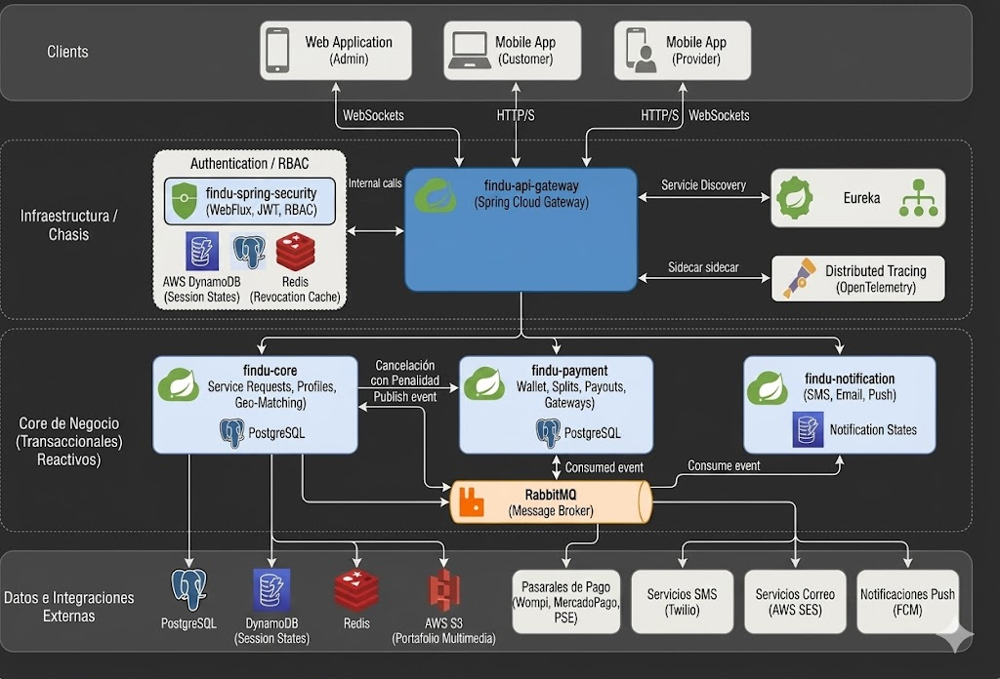

# FINDU — Arquitectura del ecosistema (visión de plataforma)

Este documento define la topología de alto nivel y los patrones de integración arquitectónica de la plataforma Findu, basada en un ecosistema de microservicios Cloud Native.

## Topología y Ecosistema de Microservicios

La arquitectura del sistema está diseñada para garantizar alta disponibilidad, escalabilidad horizontal independiente y tolerancia a fallos. Se divide estratégicamente en dos grandes bloques: los **Servicios de Infraestructura (Chasis)**, que soportan la red y enrutamiento, y los **Servicios del Core de Negocio (Transaccionales)**, que ejecutan la lógica de dominio.

### Servicios de Infraestructura (Chasis)

- **findu-api-gateway (Spring Cloud Gateway):** 
  Componente reactivo basado en WebFlux. Actúa como el único punto de entrada expuesto a los clientes (Frontend/Mobile). Implementa filtros globales de seguridad que interceptan las peticiones HTTP y consumen asíncronamente el servicio de validación de tokens de `findu-security` antes de enrutar el tráfico confiable hacia los microservicios del Core.
- **findu-service-registry (Netflix Eureka Server):** 
  Servidor de descubrimiento de servicios. Permite el registro dinámico de las instancias de los microservicios al arrancar y habilita el balanceo de carga en el lado del cliente (Load Balancing) mediante Spring Cloud LoadBalancer, eliminando la necesidad de enrutamiento por IPs estáticas.
- **RabbitMQ (Message Broker):** 
  Bus de mensajería asíncrono encargado de la comunicación orientada a eventos (EDA - Event-Driven Architecture) del ecosistema. Garantiza alta disponibilidad y tolerancia a fallos en flujos no bloqueantes inter-servicios.

### Servicios del Core de Negocio (Transaccionales)

- **findu-spring-security (Ya Implementado):** 
  Gestiona de forma centralizada la autenticación de usuarios, emisión y rotación de JWT (Access y Refresh Tokens con persistencia en memoria y DynamoDB/Redis). Maneja el control de acceso basado en roles (RBAC) evaluado dinámicamente en tiempo real mediante `FinduReactiveAuthorizationManager`.
  → [Arquitectura técnica — findu-spring-security](./findu-spring-security/findu-spring-security-architecture.md)
- **findu-core (Cerebro del Negocio):** 
  Microservicio robusto que alberga la lógica transaccional de clientes, proveedores y sus especialidades. Controla los portafolios almacenados en AWS S3, gestiona las áreas de cobertura georreferenciadas (municipios) y orquesta la compleja máquina de estados de las solicitudes de servicio (Matching y Bidding).
  → [Arquitectura técnica — findu-core](./findu-core/findu-core-architecture.md)
- **findu-payment (Gestión Financiera):** 
  Responsable de toda la integración con pasarelas de pago externas (Wompi, MercadoPago, PSE). Procesa la tabla transaccional de FACTURAS y detalles de cobros extra, realiza el cálculo de splits (comisiones de la plataforma) y gestiona la dispersión de fondos (payouts) hacia las cuentas bancarias de los proveedores.
- **findu-notification (Motor de Mensajería):** 
  Microservicio completamente desacoplado que actúa como consumidor de colas de RabbitMQ. Centraliza y procesa el envío de códigos OTP de validación, correos electrónicos transaccionales, mensajes de texto (SMS) y notificaciones Push (vía Firebase Cloud Messaging) a los dispositivos móviles de los usuarios.

### Flujo de Integración Asíncrona: Caso Crítico de Cancelación

Para evitar la saturación de hilos y asegurar una experiencia de usuario rápida, los procesos secundarios derivados de transacciones críticas se manejan mediante eventos.

**Escenario:** Cancelación tardía por parte del cliente.

1. **Detección y Cambio de Estado:** El microservicio `findu-core` recibe la solicitud de cancelación. Al detectar que ocurre fuera del tiempo de gracia, actualiza inmediatamente el estado en base de datos a `CANCELADA_CON_PENALIDAD`.
2. **Publicación del Evento:** Antes de retornar el response 200 OK al cliente, `findu-core` publica el evento de dominio (Ej. `SolicitudCanceladaEvent`) en el exchange correspondiente de **RabbitMQ**.
3. **Consumo Paralelo (Coreografía):**
   - **`findu-payment`** consume el evento de forma independiente, localiza el método de pago asociado al cliente y ejecuta el cobro de la multa para compensar al proveedor.
   - Simultáneamente, **`findu-notification`** consume el mismo evento, procesa las plantillas pertinentes y dispara una alerta Push/Email al proveedor notificando la baja de su agenda, junto con un comprobante de cobro de penalidad al cliente.

**Diagrama de arquitectura general**

